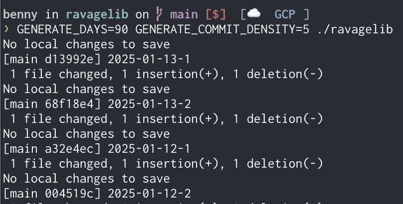

# ravagelib

This is a demo repo to demonstrate how easy it is to manipulate the Github contribution graph by simply generating useless commits, **in the past**. If you need to bypass some bullshit gatekeeping in a hiring process, this may help. Or maybe you should re-evaluate your employment choices, but some job markets are tough right now, so I'm not here to judge.

Before using ravagelib


After using ravagelib, set to backfill 90 days


## How does it work?
The `ravagelib` script generates dummy commits by updating a given `GENERATE_UPDATE_FILENAME` (default: `./update.txt`). It generates commits for `GENERATE_DAYS` amount of days in the past (default 7), and with a density of maximum `GENERATE_COMMIT_DENSITY` commits per day (default 3). It manipulates the `GIT_AUTHOR_DATE` and `GIT_COMMITTER_DATE` environment variables to create commits in the past.



```bash
GENERATE_DAYS=90 GENERATE_COMMIT_DENSITY=5 ./ravagelib
```

All you need to do is push.

## Caveats
This was thrown together in **much** less time than the commit history may suggest (duh). It was also only tested on MacOS.. Linux _should_ be fine but wasn't tested.
